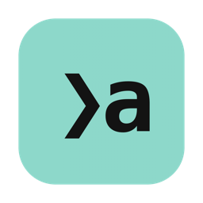

<div align="center">



# amux

**A native macOS terminal workspace for running AI coding agents in parallel.**

Inspired by [cmux](https://cmux.com) and [herdr](https://herdr.dev).

</div>

<!-- screenshot goes here -->

amux gives every coding agent its own terminal, then keeps track of what they are all
doing so you don't have to. Start Claude Code in one pane, Codex in another, put a
browser next to them, and the sidebar tells you which one finished and which one is
stuck waiting on you.

It is a single Swift app. No Electron, no local server, no Node. Terminals are real
PTYs running inside the process, rendered with SwiftTerm.

## Install

Download the latest DMG from [Releases](https://github.com/jmking/amux/releases),
open it, and drag amux to Applications.

Builds are signed and notarized by Apple, so it opens with a normal double click.

Requires macOS 14 or later on Apple silicon.

## Features

**Agents get tracked, not just launched.** amux watches every pane and works out
what the agent inside it is doing: `working`, `blocked`, `done`, or `idle`. The
sidebar becomes an inbox. Amber means busy, red means it needs an answer, teal
means it finished while you were looking somewhere else.

**You get told when something happens.** Background agents that finish or get
stuck raise a notification and a chime. Click it to jump straight to that pane.

**Spaces, panes, tabs.** A space is a project directory, usually a branch, and it
has one layout. Panes divide that layout, and each pane holds its own tabs with
its own strip across the top, so a tab belongs to the pane you put it in rather
than to the window. Each space shows its git branch, how many files are dirty,
and how far ahead of upstream it is.

**Drag tabs anywhere.** Grab a tab and drop it on a pane's edge to split that pane
and take the tab with it, on its middle to move the tab in, on another pane's strip
to join its tabs at the point you are hovering, or on a space in the sidebar to send
it across. Dropping on a pane's own edge pulls the tab out beside it. Edge targets
are picked by distance, so the top and bottom of a wide pane are as easy to hit as
its sides.

**Browser panes.** Hit `Shift+Cmd+B` for a WebKit pane, so your dev server sits
next to the agent building it. URLs persist with the layout.

**Git worktrees in one step.** Create a branch and worktree from any space and
open it as a new space, so parallel agents don't fight over one checkout.

**Your Mac stays awake while agents work.** amux holds a power assertion for as
long as anything is `working` or `blocked`, and drops it the moment they go quiet.

**Everything has three routes.** Click it, use the menu, or press `Cmd+K` for the
command palette. Nothing is keyboard-only.

## Keyboard

| Shortcut | Action |
|---|---|
| `Cmd+N` / `Cmd+T` / `Shift+Cmd+N` | New space / tab / worktree |
| `Shift+Cmd+B` | New browser tab |
| `Cmd+D` / `Shift+Cmd+D` | Split right / down |
| `Shift+Cmd+E` | Zoom pane |
| `Opt+Cmd+arrows` | Move focus between panes |
| `Cmd+1..9` / `Shift+Cmd+[` `]` | Switch or step through tabs |
| `Opt+Cmd+1..9` | Switch spaces |
| `Shift+Cmd+W` / `Opt+Cmd+W` | Close pane / tab |
| `Shift+Cmd+R` / `Shift+Cmd+A` | Run command / start agent |
| `Shift+Cmd+O` | Jump to latest notification |
| `Cmd+K` / `Cmd+0` / `Opt+Cmd+I` | Palette / sidebar / light and dark |

## Supported agents

Claude Code, Codex, and Rovo CLI are detected automatically and shown with their
own marks. Adding another one is a two line change in `Agents` in `Model.swift`:
the process name to look for, and the command to launch.

## How it works

Everything runs in one process. There is no daemon and nothing to install
alongside it.

**Terminals** are `LocalProcess` PTYs from SwiftTerm, one per pane, each started
as a login shell so your normal profile applies. Panes keep their scrollback when
you move them between tabs or spaces.

**Agent detection** walks the process tree under each pane's shell to find a known
agent, then reads the visible screen to decide what it is doing. Spinner glyphs
and "esc to interrupt" mean working, approval prompts mean blocked, and a quiet
prompt means idle. An agent that finishes while you are not looking is marked
`done` until you focus its tab, which is what makes the sidebar behave like an
inbox rather than a status list.

**Layout** is a binary tree of splits whose leaves are panes, and a pane is a group
of tabs plus which one is showing. Moves and merges rewrite the tree in a single
traversal, so a tab keeps its process no matter where it lands, and a pane that
loses its last tab collapses out of the tree.

**State** lives in `~/.config/amux/state.json`. Spaces, panes, their tabs, split
ratios, working directories and browser URLs are restored on launch, with fresh
shells.

**Performance.** Every tab in a pane stays mounted and switching only flips
visibility, so terminals are never torn down and rebuilt. Directory and git
lookups are batched onto a background tick, so nothing blocks the main thread.

## Building from source

```bash
git clone git@github.com:jmking/amux.git
cd amux/macos
swift build -c release
```

To produce a signed, notarized DMG, see [RELEASING.md](RELEASING.md).

```bash
macos/tools/release.sh
```

## Project layout

```
macos/Sources/amux/
  Model.swift         state, ops, PTY registry, agent detection, git, persistence
  TerminalHost.swift  one PTY plus one SwiftTerm view per pane
  AmuxApp.swift       app scene, menus, menu bar extra, lifecycle
  PaneArea.swift      tab bar, split layout, drag and drop, pane chrome
  Sidebar.swift       spaces and agents
  WebPane.swift       WebKit browser panes
  WorldPane.swift     the agent world pane and its run policy
  WorldMetal.swift    Metal renderer: meshes, shaders, instanced draws
  AgentSources.swift  reads what Claude and Codex record about themselves
  AgentEvents.swift   one normalised activity event for every agent kind
  Palette.swift       command palette
  Sheets.swift        dialogs
  Theme.swift         palettes, terminal themes, agent marks
  About.swift         about panel
```

## Contributing

Issues and pull requests are welcome. Fork the repo, make your change on a
branch, and open a PR against `main`.

## License

MIT, see [LICENSE](LICENSE).

amux depends on [SwiftTerm](https://github.com/migueldeicaza/SwiftTerm), also MIT.

Agent logos are trademarks of their respective owners and are used here only to
identify which agent is running in a pane.
